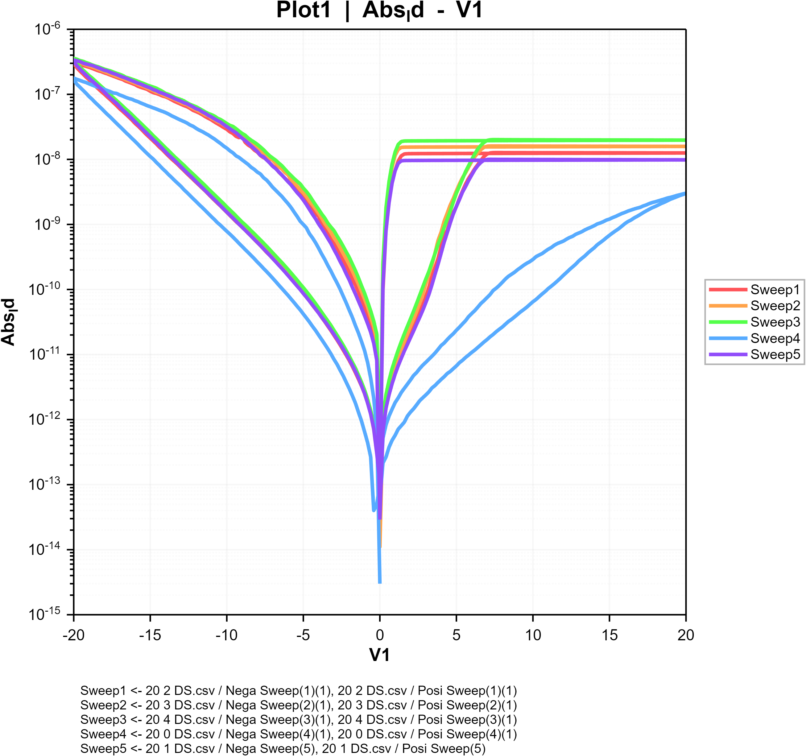

# FEDL Data Preprocessing and Plotting Tool

This folder contains a Windows GUI workflow for turning FEDL measurement raw
files into a clean, plot-ready table and then checking device curves quickly
through MATLAB-generated figures.

The tool was built to reduce repetitive lab work:

1. Load Agilent CSV or Keithley Excel measurement files.
2. Extract selected columns such as source file, source line, setup title,
   voltage, and absolute drain current.
3. Export a consolidated `raw_data.csv`.
4. Build series, groups, and plots from that table.
5. Generate MATLAB scripts and preview publication-style log-scale curves.

## Folder Layout

| Folder | Role |
| --- | --- |
| `data preprocessing` | Standalone raw-data extraction GUI, sample FEDL CSV/XLS files, generated `raw_data.csv`, and PyInstaller build scripts. |
| `plotting` | Standalone plotting GUI, MATLAB script generator, sample `raw_data.csv`, output PNG/SVG/FIG plots, and a built demo executable. |
| `final` | Integrated two-tab GUI combining preprocessing and plotting into one workflow. |
| `project_plans` | Development plan and iteration log for the plotting GUI. |
| `.venv`, `build` | Local environment and PyInstaller intermediates. These are intentionally ignored by Git. |

## Main Entry Points

Run the integrated tool:

```powershell
cd FEDL_Data\final
run_fedl_tool.bat
```

Run only raw-data preprocessing:

```powershell
cd "FEDL_Data\data preprocessing"
run_raw_data_gui.bat
```

Run only plotting:

```powershell
cd FEDL_Data\plotting
run_plotting_gui.bat
```

## Scripted Preprocessing

The PowerShell extractor can consolidate all input CSV files in a folder:

```powershell
cd "FEDL_Data\data preprocessing"
powershell -ExecutionPolicy Bypass -File build_raw_data.ps1
```

By default, it writes `raw_data.csv` in the same folder and keeps these columns:

- `source_file`
- `source_line`
- `setup_title`
- `V1`
- `Abs_Id`

## Representative Output

The integrated workflow produces log-scale FEDL curves like this:



## Build Notes

The standalone raw-data extractor can be rebuilt as a one-file Windows
executable:

```powershell
cd "FEDL_Data\data preprocessing"
build_exe.bat
```

The GitHub repository keeps the small source files, sample data, representative
figures, and selected distributable executables. Local virtual environments,
PyInstaller build intermediates, and Python caches are ignored.
