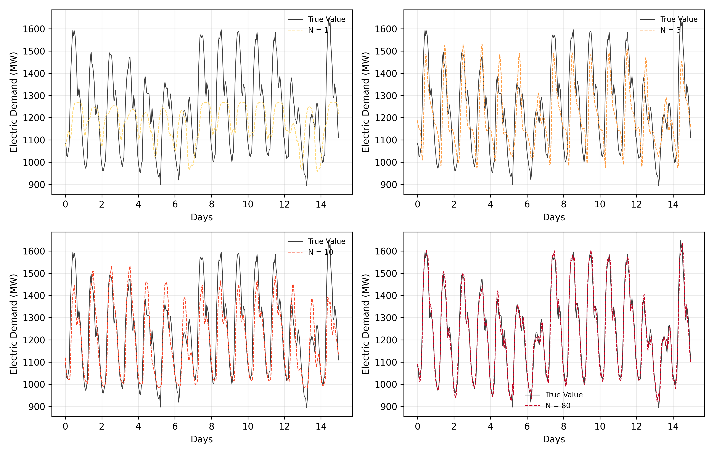
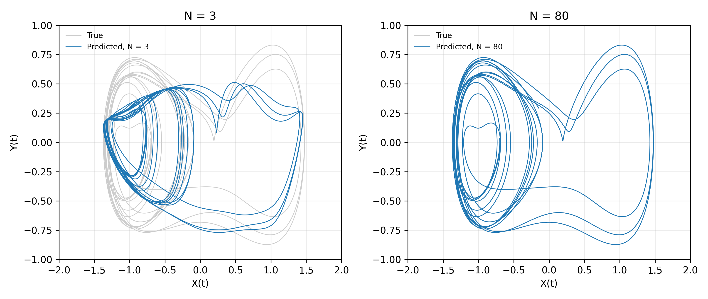
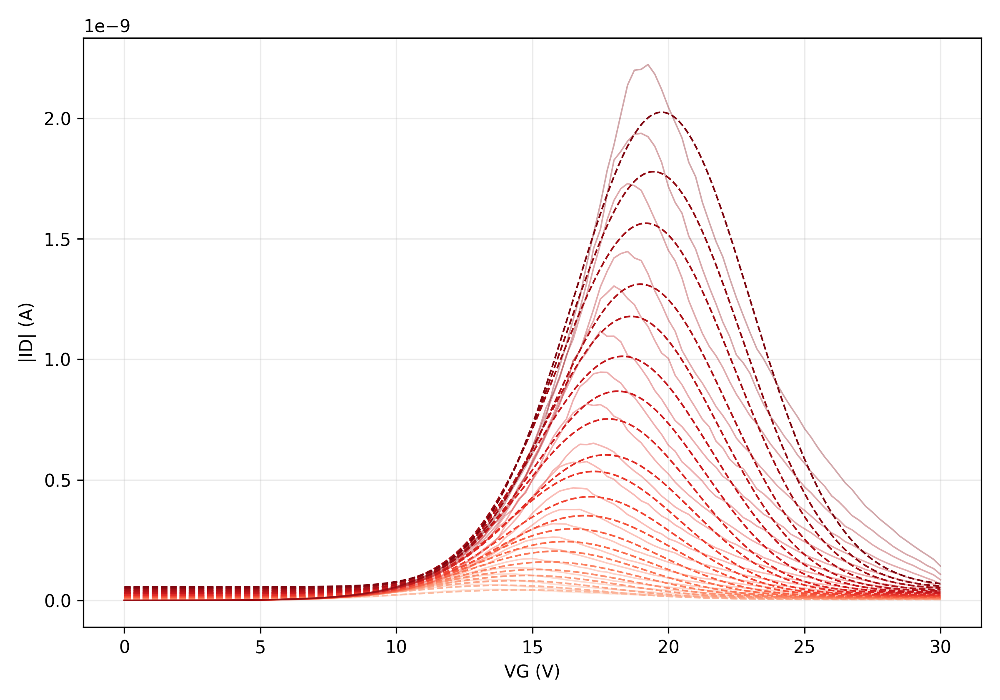

# Research Portfolio: Hardware-Aware RBF and AAT Kernel Modeling

This repository collects laboratory research code, data-processing scripts, and
reproducibility artifacts developed while exploring anti-ambipolar transistor
(AAT)-derived Gaussian kernels for forecasting and dynamical-system
reconstruction.

The projects show a progression from paper reproduction to a more
hardware-aware modeling framework:

1. Extract Gaussian parameters from measured transfer curves.
2. Convert experimentally derived width diversity into RBF kernel banks.
3. Reproduce Panama electricity-demand and Duffing oscillator experiments.
4. Extend the idea toward AAT transfer-curve libraries that use measured
   amplitude, center, width, and direct curve responses.

## Why This Repository Exists

This is a portfolio repository for research and engineering interviews. It is
organized to provide concrete evidence of:

- scientific Python development for experimental-device research,
- numerical modeling with RBF networks and least-squares readouts,
- Gaussian and rational-quadratic curve fitting of device transfer curves,
- reproducible command-line workflows with saved metrics, figures, and
  configuration files,
- documentation written for future lab use and manuscript preparation.

## Main Review Path

For a quick review, start with these files:

- [PROJECTS.md](PROJECTS.md): folder-by-folder project map.
- [REPRODUCIBILITY.md](REPRODUCIBILITY.md): recommended commands and test checks.
- [20260616Panama/flow.md](20260616Panama/flow.md): end-to-end AAT sigma to Panama RBF workflow.
- [20260616Panama/manual.md](20260616Panama/manual.md): practical user manual for sigma extraction and simulation.
- [new_AAT/README.md](new_AAT/README.md): packaged hardware-aware AAT kernel library.

## Project Highlights

| Folder | Focus | Evidence |
| --- | --- | --- |
| `20260616Panama` | Transfer-curve sigma extraction, Panama demand forecasting, Duffing reconstruction, interactive plots | CLI scripts, tests, manuals, generated figures, metrics |
| `new_AAT` | Installable hardware-aware kernel package using measured AAT curve parameters | `pyproject.toml`, package source, pytest tests, config example |
| `AAT_ap`, `AAT_ap_2`, `AAT_ap_scaled` | Iterative RBF implementations and comparison experiments | reports, guides, metrics, prediction overlays |
| `RBFRQ` | Gaussian vs rational-quadratic fitting of transfer curves | fitting script, summary CSVs, trend plots |
| `RBF_Power_Prediction`, `RBF2` | Early reproduction prototypes and baselines | source modules, figure reproduction scripts, baseline comparisons |

## Representative Outputs

Panama demand forecasting using AAT-derived sigma diversity:

Duffing oscillator reconstruction:

Transfer-curve Gaussian fitting overview:

## Technical Stack

- Python, NumPy, pandas, SciPy, scikit-learn, matplotlib
- openpyxl for Excel-based experimental data ingestion
- pytest for smoke and unit tests
- PowerShell-oriented command examples for Windows lab workflows

## Notes

- The repository intentionally keeps experimental data, generated metrics, and
  representative figures so that results can be inspected directly.
- Python caches, package build metadata, and local environment files are ignored
  by Git.
- Some older markdown files were written during active experimentation and may
  contain encoding artifacts from Korean Windows text handling. The curated
  entry points above are the recommended review path.
