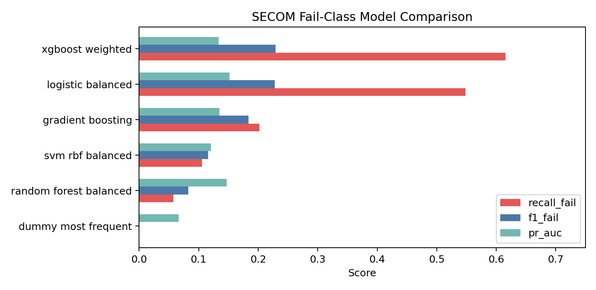
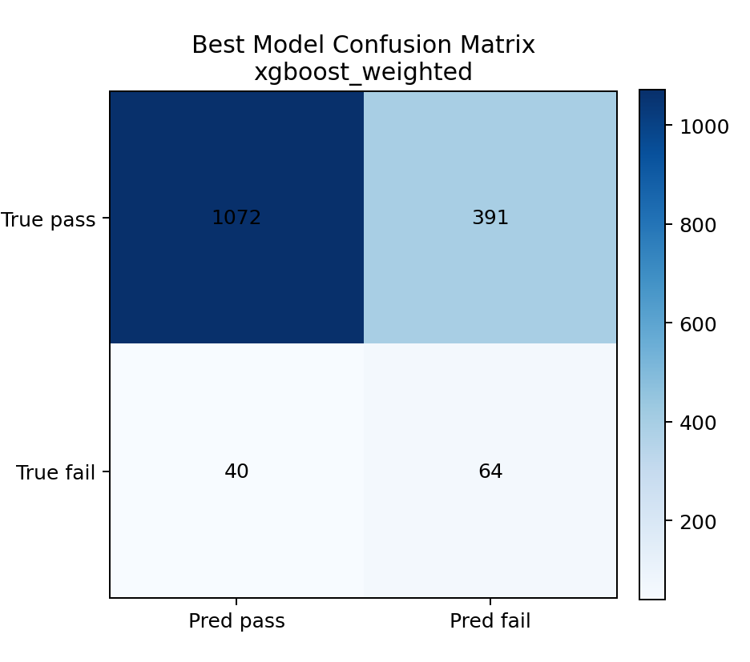
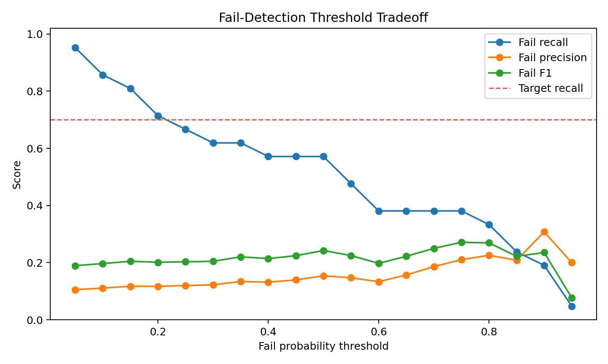

# SECOM Semiconductor Defect Prediction

Planned portfolio project for Python-based semiconductor defect prediction and
hyperparameter optimization using the SECOM semiconductor manufacturing
dataset.

The project targets a realistic yield-monitoring problem: detect rare failed
products from hundreds of anonymized process sensor signals while handling
class imbalance, missing values, high dimensionality, multicollinearity, and
process noise.

This is also documented as an AI-assisted, human-in-the-loop project. The user
defined the semiconductor problem and approval gates, while Codex helped
implement and validate the pipeline after each approved direction.

The intended portfolio message is active AI use, not passive code generation:
Codex proposes the next technical direction, the user confirms or corrects it,
and only then does Codex implement the step and run the validation harness. See
`docs/CODEX_WORKFLOW.md` and `docs/PROMPT_HARNESS.md` for the recorded prompt
and approval structure.

## Dataset

Primary source:

- UCI SECOM dataset: https://archive.ics.uci.edu/dataset/179/secom
- DOI: https://doi.org/10.24432/C54305

Kaggle mirrors of SECOM can be used as an alternate download source, but the
UCI source is kept in this project as the reproducible reference. The official
metadata describes 1567 instances, 591 features, missing values, and a pass/fail
label where `-1` is pass and `1` is fail. The rare fail class has 104 samples,
which creates roughly a 14:1 class imbalance.

## Research Questions

1. Which preprocessing strategy best improves rare-defect recall without
   making precision unusable?
2. How much does SMOTE improve F1-score and recall compared with class-weighted
   models?
3. Which model family is most suitable for the SECOM setting: linear baseline,
   tree ensemble, boosted tree, SVM, or anomaly-oriented classifier?
4. How many sensor features are actually needed after missing-value filtering,
   low-variance filtering, and feature-importance selection?
5. Which sensors dominate the final model, and how can that be explained as a
   semiconductor process-monitoring story?

## Planned Pipeline

```text
Raw SECOM files
  -> label normalization (-1 pass, 1 fail)
  -> train/test split with stratification
  -> missing-column drop threshold
  -> imputation: median, KNN, or forward-fill fallback
  -> variance-threshold filtering
  -> scaling where needed
  -> optional SMOTE on the training fold only
  -> feature selection with Random Forest importance
  -> model training and hyperparameter search
  -> F1, recall, PR-AUC, ROC-AUC, balanced accuracy comparison
  -> confusion matrix and feature-importance report
```

## Model Candidates

| Family | Purpose |
| --- | --- |
| Dummy classifier | Accuracy-trap baseline that shows why accuracy is misleading |
| Logistic Regression | Interpretable linear baseline with class weights |
| Random Forest | Robust nonlinear baseline and feature-importance source |
| SVM | Margin-based model for high-dimensional sensor data |
| Gradient Boosting / XGBoost | Strong tabular-data candidate for final benchmark |

## Evaluation Policy

Accuracy is intentionally not the main success metric. The primary metrics are:

- `recall_fail`: ability to catch defective wafers/products,
- `f1_fail`: balance between fail precision and fail recall,
- `pr_auc`: useful under rare positive labels,
- `balanced_accuracy`: sanity check across both classes,
- confusion matrix: direct count of missed fail samples.

The train/test split and all cross-validation folds must be stratified. SMOTE or
any other resampling must be applied only inside the training fold to prevent
data leakage.

## Current Scaffold

- `PROJECT_PLAN.md`: portfolio narrative, milestones, and experiment matrix.
- `MODEL_CARD.md`: final model intent, evaluation policy, limitations, and next steps.
- `BASELINE_NOTES.md`: first smoke-run result and next experiment direction.
- `docs/REQUIREMENT_TRACEABILITY.md`: mapping from project requirements to code and reports.
- `docs/CODEX_WORKFLOW.md`: AI-assisted, human-in-the-loop development record.
- `docs/PROMPT_HARNESS.md`: prompt structure and validation harness.
- `docs/COMMAND_LOG.md`: command log and observed benchmark evidence.
- `docs/PORTFOLIO_BRIEF_KR.md`: Korean interview-oriented project summary.
- `configs/experiment_matrix.yaml`: planned preprocessing/model combinations.
- `src/secom_defect/`: reusable data-loading and modeling utilities.
- `run_experiment.py`: CLI entry point for the first reproducible experiment.
- `reports/final/`: curated portfolio report snapshot.

## Current Result Snapshot

The current final snapshot uses a 5-fold SMOTE + median-imputation + top-50
feature workflow. XGBoost produced the strongest fail-class recall in this
snapshot.

| Model | Fail recall | Fail precision | Fail F1 | PR-AUC | Balanced accuracy |
| --- | ---: | ---: | ---: | ---: | ---: |
| XGBoost weighted | 0.615 | 0.141 | 0.229 | 0.134 | 0.674 |





Threshold analysis shows that lowering the fail-probability threshold can catch
more defects at the cost of additional false alarms.



## Setup

```powershell
cd SECOM_Defect_Prediction
py -3 -m pip install -r requirements.txt
```

Run the validation harness:

```powershell
.\scripts\run_validation.ps1 -Mode compile
```

Run a first benchmark after dependencies are installed:

```powershell
py -3 run_experiment.py --download --output-dir reports/baseline
```

If Kaggle files are already downloaded, place them under `data/raw/` and run:

```powershell
py -3 run_experiment.py --data-dir data/raw --output-dir reports/local_kaggle
```

Expected report files:

- `metrics_summary.csv`
- `classification_reports.json`
- `confusion_matrices.csv`
- `selected_features.csv`
- `feature_importance.csv`
- `model_metric_comparison.png`
- `best_model_confusion_matrix.png`
- `top_feature_importance.png`

Compare multiple preprocessing strategies:

```powershell
py -3 scripts\compare_reports.py --reports reports\smoke reports\smote_median_top30 reports\smote_knn_top30 --names no_smote_median smote_median smote_knn --output-dir reports\comparison
```

Expected comparison outputs:

- `experiment_model_metrics.csv`
- `experiment_best_summary.csv`
- `preprocessing_comparison.png`

Generated working reports are ignored by default. When the project is finalized
for GitHub, selected summary outputs can be copied into `reports/final/`, which
is intentionally allowed by `.gitignore`.

Run a focused hyperparameter search:

```powershell
py -3 tune_model.py --download --model logistic_balanced --output-dir reports\tuning_logistic_smote_median_top30 --splits 3 --n-iter 20 --top-k 30 --imputer median --resampling smote
```

Tuning outputs:

- `tuning_cv_results.csv`
- `best_params.json`
- `holdout_classification_report.json`
- `holdout_confusion_matrix.csv`

Analyze recall/false-alarm threshold tradeoffs:

```powershell
py -3 threshold_analysis.py --download --model xgboost_weighted --output-dir reports\threshold_xgboost_smote_median_top50 --top-k 50 --imputer median --resampling smote --target-recall 0.70
```

Threshold outputs:

- `threshold_tradeoff.csv`
- `recommended_threshold.json`
- `threshold_tradeoff.png`

The curated `reports/final/` snapshot also includes selected feature,
feature-importance, class-distribution, missingness, and tuning-result tables
for portfolio review.
