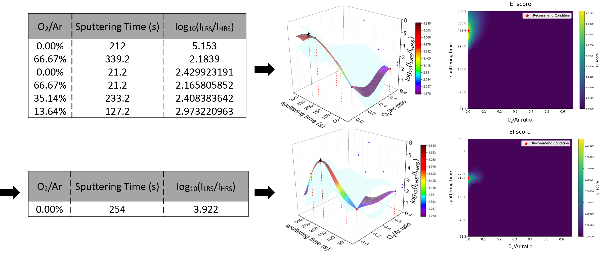
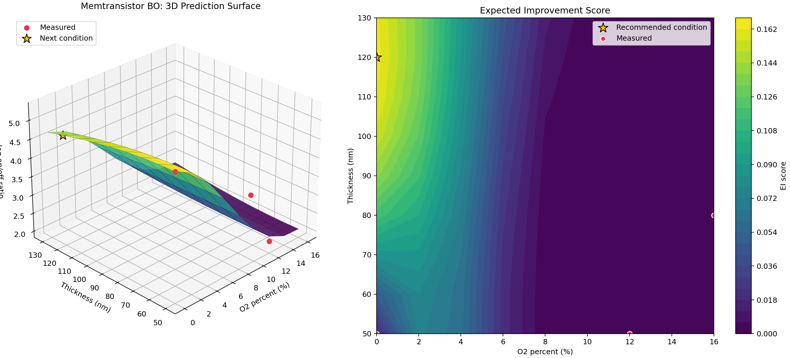

# Memtransistor Bayesian Optimization

This folder contains a lab workflow for optimizing oxide TFT and memtransistor
process conditions with Gaussian-process Bayesian optimization.

The project started with TFT screening experiments, then moved to
memtransistor optimization. The code compares several Gaussian-process kernels
and acquisition settings, including RBF, Constant x RBF, Rational Quadratic,
and Matern variants. The portfolio snapshot keeps the scripts and outputs that
best explain the final workflow while leaving rough local drafts out of Git.

RBF/RQ comparison generated during the project:



Preview regenerated from the saved CSV prediction grid:



## Research Goal

Use a small number of process experiments to recommend the next promising
condition for oxide semiconductor devices.

Main optimization targets:

- TFT screening: maximize field-effect mobility from O2/Ar ratio and film
  thickness.
- TFT full-CSV test: combine mobility, threshold voltage, and subthreshold
  swing into a figure of merit.
- Memtransistor optimization: maximize log on/off ratio from oxygen fraction
  and thickness.

## Review Path

| Area | File or folder | What to inspect |
| --- | --- | --- |
| TFT final package | `TFT/250723 TFT BO_HH/` | CSV-input mobility BO script, seed data, prediction grid, next-point recommendation, and presentation deck |
| Memtransistor final scripts | `memT/csv input/` | RBF and Constant x RBF CSV-input BO workflows for on/off-ratio optimization |
| RQ comparison | `memT/csv input/*/(ratio,thickness)-retention, excel (Const+RQ)_file load.py` | Rational Quadratic kernel variant used for kernel comparison |
| TFT pre-test | `memT/TEST/TFT test.py` | Matern-kernel TFT process optimizer using `power`, `pressure`, and gas ratio with a mobility/Vth/SS FOM |
| Early prototype | `main/` | Smaller Excel/CSV prototype before the final TFT package |
| Result evidence | `memT/RBF 결과/`, `memT/retention_prediction_iter_*.xlsx` | Saved prediction grids and iteration outputs from parameter/kernel sweeps |
| Device context | `memT/band_structure_comparison.png`, `memT/memt BO.opj` | Supporting analysis figure and Origin project file |

## Core Workflow

1. Load seed experimental data from CSV.
2. Convert gas-flow settings into O2/Ar ratio or O2 percentage features.
3. Fit a GaussianProcessRegressor with the selected kernel.
4. Predict the response over the full candidate grid.
5. Calculate Expected Improvement.
6. Save the prediction grid, current experimental data, and recommended next
   point as CSV or Excel files.
7. Enter the next measured value and repeat the loop.

## Key Data Schemas

TFT mobility CSV:

```text
O2_ratio,thickness,mobility
```

Memtransistor on/off-ratio CSV:

```text
O2_percent,thickness,on_off_ratio
```

TFT full-CSV process test:

```text
power,pressure,Gas ratio,mu_fe,vth,ss
```

## Reproducibility

Install the common scientific Python stack:

```powershell
py -3 -m pip install numpy pandas scipy scikit-learn matplotlib openpyxl
```

Compile the curated Python scripts:

```powershell
py -3 memT_BO\scripts\make_prediction_preview.py
py -3 -m py_compile "memT_BO\TFT\250723 TFT BO_HH\simple TFT BO(ratio-mobility)(Cons&RBF)_csv input.py"
py -3 -m py_compile "memT_BO\memT\csv input\(ratio,thickness)-retention, excel (ConRBF)_file load_NEW_1.py"
py -3 -m py_compile "memT_BO\memT\csv input\(ratio,thickness)-retention, excel (RBF)_file load_NEW_1.py"
py -3 -m py_compile "memT_BO\memT\csv input\새 폴더\(ratio,thickness)-retention, excel (Const+RBF)_file load_NEW_1.py"
py -3 -m py_compile "memT_BO\memT\csv input\새 폴더\(ratio,thickness)-retention, excel (Const+RQ)_file load.py"
py -3 -m py_compile "memT_BO\memT\TEST\TFT test.py"
```

Run the TFT final workflow from its data folder:

```powershell
cd "memT_BO\TFT\250723 TFT BO_HH"
py -3 "simple TFT BO(ratio-mobility)(Cons&RBF)_csv input.py"
```

Run the memtransistor workflow from the CSV-input folder:

```powershell
cd "memT_BO\memT\csv input"
py -3 "(ratio,thickness)-retention, excel (ConRBF)_file load_NEW_1.py"
```

The scripts are interactive after each iteration. They automatically load the
seed CSV when present, write prediction grids, display plots, and then ask
whether to continue with a newly measured point.

## Representative Saved Outputs

- `TFT/250723 TFT BO_HH/mobility_prediction_iter_0.csv`
- `TFT/250723 TFT BO_HH/next_point_iter_0.csv`
- `memT/csv input/onoff_ratio_prediction_iter_0.csv`
- `memT/csv input/next_point_iter_0.csv`
- `assets/memT_bo_rbf_rq_prediction_comparison.png`
- `assets/memT_bo_generated_prediction_preview.png`
- `memT/RBF 결과/*.xlsx`
- `memT/retention_prediction_iter_final.xlsx`
